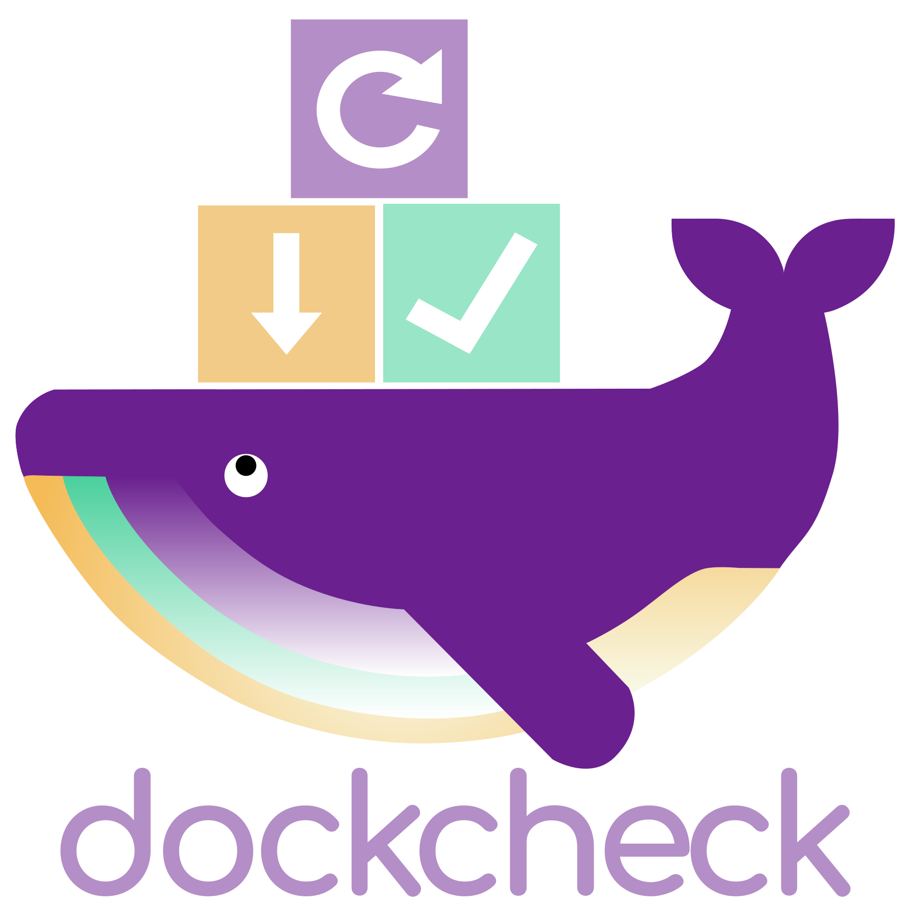

<p align="center">
  
</p>
<p align="center">
  
  <a href="https://www.gnu.org/licenses/gpl-3.0.html"></a>
  
  <br>
  <a href="https://ko-fi.com/mag37"></a>
  <a href="https://liberapay.com/user-bin-rob/donate"></a>
  <a href="https://github.com/sponsors/mag37"></a>
  <a href="https://www.paypal.com/donate/?business=P2V5MCWRGCNBG&no_recurring=0&currency_code=SEK"></a>
</p>

<h2 align="center">CLI tool to automate docker image updates or notifying when updates are available.</h2>
<h3 align="center">selective updates, exclude containers, custom labels, notification plugins, prune when done etc.</h3>

<h4 align="center">:whale: Docker Hub pull limit :chart_with_downwards_trend: not an issue for checks but for actual pulls - <a href="#whale-docker-hub-pull-limit-chart_with_downwards_trend-not-an-issue-for-checks-but-for-actual-pulls">read more</a></h4>

<h5 align="center">For Podman - see the fork <a href="https://github.com/sudo-kraken/podcheck">sudo-kraken/podcheck</a>!</h4>

___
## Changelog


- **v0.7.2**:
    - Label rework:
      - Moved up label logic to work globally on the current run.
      - Only iterating on labeled containers when used with `-l` option, not listing others.
      - Clarified messaging and readme/help texts.
    - List reformatting for "available updates" numbering to easier highlight and copy:
      - Padded with zero, changed `)` to `-`, example: `02 - homer`
      - Can be selected by writing `2,3,4` or `02,03,04`.
- **v0.7.1**:
    - Added support for multiple notifications using the same template
    - Added support for notification output format
    - Added support for file output
    - Added optional configuration variables per channel to (replace `<channel>` with any channel name):
      - `<channel>_TEMPLATE` : Specify a template
      - `<channel>_SKIPSNOOZE` : Skip snooze
      - `<channel>_CONTAINERSONLY` : Only notify for docker container related updates
      - `<channel>_ALLOWEMPTY` : Always send notifications, even when empty
      - `<channel>_OUTPUT` : Define output format
- **v0.7.0**:
    - Bugfix: snooze dockcheck.sh-self-notification and some config clarification.
    - Added authentication support to Ntfy.sh.
    - Added suport for sendmail in the SMTP-template.
___


## `dockcheck.sh`
```
$ ./dockcheck.sh -h
Syntax:     dockcheck.sh [OPTION] [comma separated names to include]
Example:    dockcheck.sh -y -x 10 -d 10 -e nextcloud,heimdall

Options:
-a|y   Automatic updates, without interaction.
-c D   Exports metrics as prom file for the prometheus node_exporter. Provide the collector textfile directory.
-d N   Only update to new images that are N+ days old. Lists too recent with +prefix and age. 2xSlower.
-e X   Exclude containers, separated by comma.
-f     Force stop+start stack after update. Caution: restarts once for every updated container within stack.
-F     Only compose up the specific container, not the whole compose stack (useful for master-compose structure).
-h     Print this Help.
-i     Inform - send a preconfigured notification.
-I     Prints custom releasenote urls alongside each container with updates in CLI output (requires urls.list).
-l     Only include containers with label set. See readme.
-m     Monochrome mode, no printf colour codes and hides progress bar.
-M     Prints custom releasenote urls as markdown (requires template support).
-n     No updates, only checking availability.
-p     Auto-Prune dangling images after update.
-r     Allow checking for updates/updating images for docker run containers. Won't update the container.
-s     Include stopped containers in the check. (Logic: docker ps -a).
-t N   Set a timeout (in seconds) per container for registry checkups, 10 is default.
-u     Allow automatic self updates - caution as this will pull new code and autorun it.
-v     Prints current version.
-x N   Set max asynchronous subprocesses, 1 default, 0 to disable, 32+ tested.
```

### Basic example:
```
$ ./dockcheck.sh
. . .
Containers on latest version:
glances
homer

Containers with updates available:
1) adguardhome
2) syncthing
3) whoogle-search

Choose what containers to update:
Enter number(s) separated by comma, [a] for all - [q] to quit:
```
Then it proceeds to run `pull` and `up -d` on every container with updates.  
After the updates are complete, you'll get prompted if you'd like to prune dangling images.

___

## Dependencies
- Running docker (duh) and compose, either standalone or plugin. (see [Podman fork](https://github.com/sudo-kraken/podcheck)  
- Bash shell or compatible shell of at least v4.3
  - POSIX `xargs`, usually default but can be installed with the `findutils` package - to enable async.
- [jq](https://github.com/jqlang/jq)
  - User will be prompted to install with package manager or download static binary.
- [regclient/regctl](https://github.com/regclient/regclient) (Licensed under [Apache-2.0 License](http://www.apache.org/licenses/LICENSE-2.0))  
  - User will be prompted to download `regctl` if not in `PATH` or `PWD`.  
  - regctl requires `amd64/arm64` - see [workaround](#roller_coaster-workaround-for-non-amd64--arm64) if other architecture is used.

## Install Instructions
Download the script to a directory in **PATH**, I'd suggest using `~/.local/bin` as that's usually in **PATH**.  
For OSX/macOS preferably use `/usr/local/bin`.
```sh
# basic example with curl:
curl -L https://raw.githubusercontent.com/mag37/dockcheck/main/dockcheck.sh -o ~/.local/bin/dockcheck.sh
chmod +x ~/.local/bin/dockcheck.sh

# or oneliner with wget:
wget -O ~/.local/bin/dockcheck.sh "https://raw.githubusercontent.com/mag37/dockcheck/main/dockcheck.sh" && chmod +x ~/.local/bin/dockcheck.sh

# OSX or macOS version with curl:
 curl -L https://raw.githubusercontent.com/mag37/dockcheck/main/dockcheck.sh -o /usr/local/bin/dockcheck.sh && chmod +x /usr/local/bin/dockcheck.sh
```
Then call the script anywhere with just `dockcheck.sh`.
Add preferred `notify.sh`-template to the same directory - this will not be touched by the scripts self-update function.

## Configuration
To modify settings and have them persist through updates - copy the `default.config` to `dockcheck.config` alongside the script or in `~/.config/`.  
Alternatively create an alias where specific flags and values are set.  
Example `alias dc=dockcheck.sh -p -x 10 -t 3`.

## Notifications
Triggered with the `-i` flag. Will send a list of containers with updates available and a notification when `dockcheck.sh` itself has an update.
`notify_templates/notify_v2.sh` is the default notification wrapper, if `notify.sh` is present and configured, it will override.

Example of a cron scheduled job running non-interactive at 10'oclock excluding 1 container and sending notifications:
`0 10 * * * /home/user123/.local/bin/dockcheck.sh -nix 10 -e excluded_container1`

#### Installation and configuration:
Set up a directory structure as below.
You only need the `notify_templates/notify_v2.sh` file and any notification templates you wish to enable, but there is no harm in having all of them present.
```
 .
├── notify_templates/
│   ├── notify_DSM.sh
│   ├── notify_apprise.sh
│   ├── notify_discord.sh
│   ├── notify_generic.sh
│   ├── notify_gotify.sh
│   ├── notify_HA.sh
│   ├── notify_matrix.sh
│   ├── notify_ntfy.sh
│   ├── notify_pushbullet.sh
│   ├── notify_pushover.sh
│   ├── notify_slack.sh
│   ├── notify_smtp.sh
│   ├── notify_telegram.sh
│   └── notify_v2.sh
├── dockcheck.config
├── dockcheck.sh
└── urls.list         # optional
```
- Uncomment and set the `NOTIFY_CHANNELS=""` environment variable in `dockcheck.config` to a space separated string of your desired notification channels to enable.
- Uncomment and set the environment variables related to the enabled notification channels. Eg. `GOTIFY_DOMAIN=""` + `GOTIFY_TOKEN=""`.

It's recommended to only do configuration with variables within `dockcheck.config` and not modify `notify_templates/notify_X.sh` directly. If you wish to customize the notify templates yourself, you may copy them to your project root directory alongside the main `dockcheck.sh` (where they're also ignored by git).  
Customizing `notify_v2.sh` is handled the same as customizing the templates, but it must be renamed to `notify.sh` within the `dockcheck.sh` root directory.  


#### Snooze feature:
Configure to receive scheduled notifications only if they're new since the last notification - within a set time frame.

**Example:** *Dockcheck is scheduled to run every hour. You will receive an update notification within an hour of availability.*  
**Snooze enabled:** You will not receive a repeated notification about an already notified update within the snooze duration.  
**Snooze disabled:** You will receive additional (possibly repeated) notifications every hour.  

To enable snooze uncomment the `SNOOZE_SECONDS` variable in your `dockcheck.config` and set it to the number of seconds you wish to prevent duplicate alerts.  
Snooze is split into three categories; container updates, `dockcheck.sh` self updates and notification template updates.

If an update becomes available for an item that is not snoozed, notifications will be sent and include all available updates for that item's category, even snoozed items.

The actual snooze duration will be 60 seconds less than `SNOOZE_SECONDS` to account for minor scheduling or run time issues.


#### Current notify templates:
- Synology [DSM](https://www.synology.com/en-global/dsm)
- Email with [mSMTP](https://wiki.debian.org/msmtp) (or deprecated alternative [sSMTP](https://wiki.debian.org/sSMTP))
- Apprise (with it's [multitude](https://github.com/caronc/apprise#supported-notifications) of notifications)
  - both native [caronc/apprise](https://github.com/caronc/apprise) and the standalone [linuxserver/docker-apprise-api](https://github.com/linuxserver/docker-apprise-api)
  - Read the [QuickStart](extras/apprise_quickstart.md)
- [ntfy](https://ntfy.sh/) - HTTP-based pub-sub notifications.
- [Gotify](https://gotify.net/) - a simple server for sending and receiving messages.
- [Home Assistant](https://www.home-assistant.io/integrations/notify/) - Connection to the notify [integrations](https://www.home-assistant.io/integrations/#notifications).
- [Pushbullet](https://www.pushbullet.com/) - connecting different devices with cross-platform features.
- [Telegram](https://telegram.org/) - Telegram chat API.
- [Matrix-Synapse](https://github.com/element-hq/synapse) - [Matrix](https://matrix.org/), open, secure, decentralised communication.
- [Pushover](https://pushover.net/) - Simple Notifications (to your phone, wearables, desktops)
- [Discord](https://support.discord.com/hc/en-us/articles/228383668-Intro-to-Webhooks) - Discord webhooks.
- [Slack](https://api.slack.com/tutorials/tracks/posting-messages-with-curl) - Slack curl api

Further additions are welcome - suggestions or PRs!
<sub><sup>Initiated and first contributed by [yoyoma2](https://github.com/yoyoma2).</sup></sub>

#### Notification channel configuration:
All required environment variables for each notification channel are provided in the default.config file as comments and must be uncommented and modified for your requirements.  
For advanced users, additional functionality is available via custom configurations and environment variables.  
Use cases - all configured in `dockcheck.config`:  
(replace `<channel>` with the upper case name of the of the channel as listed in `NOTIFY_CHANNELS` variable, eg `TELEGRAM_SKIPSNOOZE`)
- To bypass the snooze feature, even when enabled, add the variable `<channel>_SKIPSNOOZE` and set it to `true`.
- To configure the channel to only send container update notifications, add the variable `<channel>_CONTAINERSONLY` and set it to `true`.
- To send notifications even when there are no updates available, add the variable `<channel>_ALLOWEMPTY`  and set it to `true`.
- To use another notification output format, add the variable `<channel>_OUTPUT` and set it to `csv`, `json`, or `text`. If unset or set to an invalid value, defaults to `text`.
- To send multiple notifications using the same notification template:
  - Strings in the `NOTIFY_CHANNELS` list are now treated as unique names and do not necessarily refer to the notification template that will be called, though they do by default.
  - Add another notification channel to `NOTIFY_CHANNELS` in `dockcheck.config`. The name can contain upper and lower case letters, numbers and underscores, but can't start with a number.
  - Add the variable `<channel>_TEMPLATE` to `dockcheck.config` where `<channel>` is the name of the channel added above and set the value to an available notification template script (`slack`, `apprise`, `gotify`, etc.)
  - Add all other environment variables required for the chosen template to function with `<channel>` in upper case as the prefix rather than the template name.
    - For example, if `<channel>` is `mynotification` and the template configured is `slack`, you would need to set `MYNOTIFICATION_CHANNEL_ID` and `MYNOTIFICATION_ACCESS_TOKEN`.

### Release notes addon
There's a function to use a lookup-file to add release note URL's to the notification message.  
Copy the notify_templates/`urls.list` file to the script directory, it will be used automatically if it's there.  
Modify it as necessary, the names of interest in the left column needs to match your container names.  
To also list the URL's in the CLI output (choose containers list) use the `-I` option or variable config.  
For Markdown formatting also add the `-M` option. (**this requires the template to be compatible - see gotify for example**)  

The output of the notification will look something like this:
```
Containers on hostname with updates available:
apprise-api  ->  https://github.com/linuxserver/docker-apprise-api/releases
homer  ->  https://github.com/bastienwirtz/homer/releases
nginx  ->  https://github.com/docker-library/official-images/blob/master/library/nginx
...
```
The `urls.list` file is just an example and I'd gladly see that people contribute back when they add their preferred URLs to their lists.

## Asyncronous update checks with **xargs**; `-x N` option. (default=1)
Pass `-x N` where N is number of subprocesses allowed, experiment in your environment to find a suitable max!  
Change the default value by editing the `MaxAsync=N` variable in `dockcheck.sh`. To disable the subprocess function set `MaxAsync=0`.


## Extra plugins and tools:

### Using dockcheck.sh with the Synology DSM
If you run your container through the *Container Manager GUI* - only notifications are supported.  
While if running manual (vanilla docker compose CLI) will allow you to use the update function too.  
Some extra setup to tie together with Synology DSM - check out the [addons/DSM/README.md](./addons/DSM/README.md).

### Prometheus and node_exporter
Dockcheck can be used together with [Prometheus](https://github.com/prometheus/prometheus) and [node_exporter](https://github.com/prometheus/node_exporter) to export metrics via the file collector, scheduled with cron or likely.
This is done with the `-c` option, like this:
```
dockcheck.sh -c /path/to/exporter/directory
```

See the [README.md](./addons/prometheus/README.md) for more detailed information on how to set it up!  
<sub><sup>Contributed by [tdralle](https://github.com/tdralle).</sup></sub>  

### Zabbix config to monitor docker image updates
If you already use Zabbix - this config will show numbers of available docker image updates on host.  
Example: *2 Docker Image updates on host-xyz*  
See project: [thetorminal/zabbix-docker-image-updates](https://github.com/thetorminal/zabbix-docker-image-updates)

### Serve REST API to list all available updates
A custom python script to serve a REST API to get pulled into other monitoring tools like [homepage](https://github.com/gethomepage/homepage).  
See [discussion here](https://github.com/mag37/dockcheck/discussions/146).

### Wrapper Script for Unraid's User Scripts
A custom bash wrapper script to allow the usage of dockcheck as a Unraid User Script plugin.  
See [discussion here](https://github.com/mag37/dockcheck/discussions/145).

## Labels
Optionally add labels to compose-files. Currently these are the usable labels:
```
    labels:
      mag37.dockcheck.update: true
      mag37.dockcheck.only-specific-container: true
      mag37.dockcheck.restart-stack: true
```
- `mag37.dockcheck.update: true` will when used with the `-l` option only check and update containers with this label set and skip the rest.  
- `mag37.dockcheck.only-specific-container: true` works instead of the `-F` option, specifying the updated container when doing compose up, like `docker compose up -d homer`.
- `mag37.dockcheck.restart-stack: true` works instead of the `-f` option, forcing stop+restart on the whole compose-stack (Caution: Will restart on every updated container within stack).

Adding or modifying labels in compose-files requires a restart of the container to take effect.

## Workaround for non **amd64** / **arm64**
`regctl` provides binaries for amd64/arm64, to use on other architecture you could try this workaround.
Run regctl in a container wrapped in a shell script. Copied from [regclient/docs/install.md](https://github.com/regclient/regclient/blob/main/docs/install.md):

```sh
cat >regctl <<EOF
#!/bin/sh
opts=""
case "\$*" in
  "registry login"*) opts="-t";;
esac
docker container run \$opts -i --rm --net host \\
  -u "\$(id -u):\$(id -g)" -e HOME -v \$HOME:\$HOME \\
  -v /etc/docker/certs.d:/etc/docker/certs.d:ro \\
  ghcr.io/regclient/regctl:latest "\$@"
EOF
chmod 755 regctl
```
Test it with `./regctl --help` and then either add the file to the same path as *dockcheck.sh* or in your path (eg. `~/.local/bin/regctl`).

## Docker Hub pull limit :chart_with_downwards_trend: not an issue for checks but for actual pulls
Due to recent changes in [Docker Hub usage and limits](https://docs.docker.com/docker-hub/usage/)
>Unauthenticated users: 10 pulls/hour  
>Authenticated users with a free account: 100 pulls/hour

This is not an issue for registry checks. But if you have a large stack and pull more than 10 updates at once consider updating more often or to create a free account.
You could use/modify the login-wrapper function in the example below to automate the login prior to running `dockcheck.sh`.

### Function to auth with docker hub before running
**Example** - Change names, paths, and remove cat+password flag if you rather get prompted:
```sh
function dchk {
  cat ~/pwd.txt | docker login --username YourUser --password-stdin
  ~/dockcheck.sh "$@"
}
```

## `-r flag` disclaimer and warning
**Wont auto-update the containers, only their images. (compose is recommended)**  
`docker run` dont support using new images just by restarting a container.  
Containers need to be manually stopped, removed and created again to run on the new image.  
Using the `-r` option together with eg. `-i` and `-n` to just check for updates and send notifications and not update is safe though!

## Known issues
- No detailed error feedback (just skip + list what's skipped).
- Not respecting `--profile` options when re-creating the container.
- Not working well with containers created by **Portainer**.
- **Watchtower** might cause issues due to retagging images when checking for updates (and thereby pulling new images).

## Debugging
If you hit issues, you could check the output of the `extras/errorCheck.sh` script for clues.
Another option is to run the main script with debugging in a subshell `bash -x dockcheck.sh` - if there's a particular container/image that's causing issues you can filter for just that through `bash -x dockcheck.sh nginx`.

## License
dockcheck is created and released under the [GNU GPL v3.0](https://www.gnu.org/licenses/gpl-3.0-standalone.html) license.

## Sponsorlist

- [avegy](https://github.com/avegy)
- [eichhorn](https://github.com/eichhorn)
- [stepdg](https://github.com/stepdg)
- [acer2220](https://github.com/acer2220)
- [shgew](https://github.com/shgew)
___

### The [story](https://mag37.org/posts/project_dockcheck/) behind it. 1 year in retrospect.
