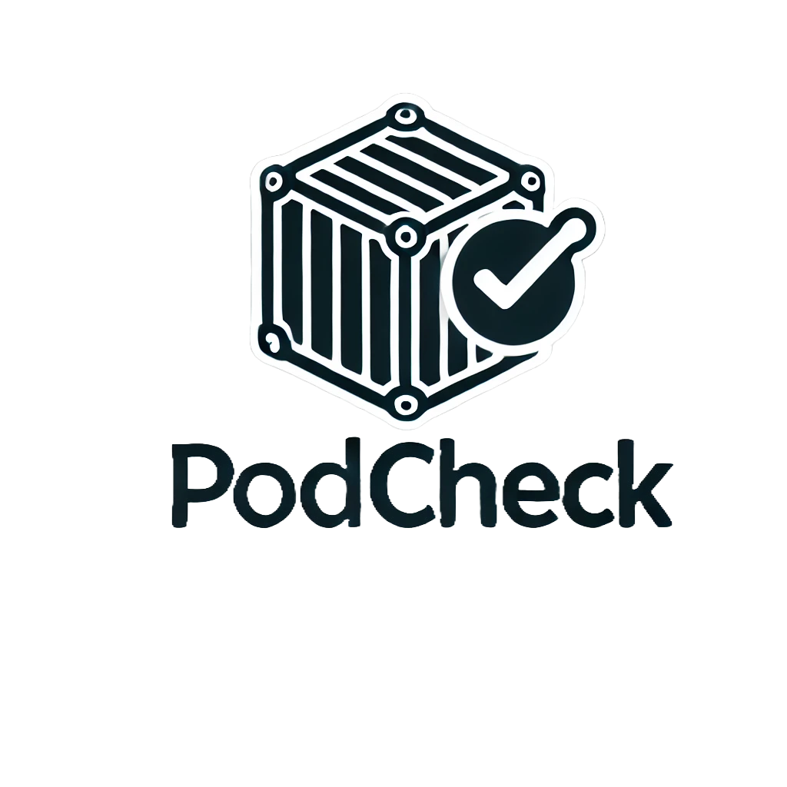

<p align="center">
  
</p>
<p align="center">
  
  <a href="https://www.gnu.org/licenses/gpl-3.0.html"></a>
  
  <a href="https://www.buymeacoffee.com/jharrison94">
</p>

<h3 align="center">CLI tool to automate Podman image updates. <br>Selective updates, optional notifications, and image pruning when done.</h3>
<h2 align="center">Now with simple notification integrations!</h2>
<h4 align="center">Features include excluding specific containers, custom container labels, auto-prune when done, and more.</h4>

___
## :bell: Changelog
- **v0.6.0**:
    - **Grafana & Prometheus Integration:**  
      - Added a detailed Prometheus metrics exporter that now reports not only the number of containers with updates, no-updates, and errors, but also the total number of containers checked, the duration of the update check, and the epoch timestamp of the last check.
      - Enhanced documentation with instructions on integrating these metrics with Grafana for visual monitoring.
    - **Improved Error Handling & Code Refactoring:**  
      - Introduced `set -euo pipefail` and local variable scoping within functions to improve reliability and prevent unexpected behaviour.
      - Standardised container name handling and refined the Quadlet detection logic.
    - **Self-Update Enhancements:**  
      - Updated the self-update mechanism to support both Git-based and HTTP-based updates, with an automatic restart that preserves the original arguments.
    - **Miscellaneous Improvements:**  
      - Enhanced dependency installer to support both package manager and static binary installations for `jq` and `regctl`.
      - General code refactoring across the project for better readability and maintainability.
- **v0.5.7**: Rewrite of dependency downloads, now jq can be installed with package manager or static binary.
- **v0.5.6**: Directly checking for systemd units matching container names.
    - Improved Quadlet detection by checking for systemd units named after the container.
    - Ensures better compatibility with Quadlet-managed containers.
- **v0.5.5**: Switched to podman compose command.
    - Adjusted the script to use podman compose instead of podman-compose.
    - Removed unnecessary messages.
- **v0.5.4**: Improved Quadlet detection by matching container IDs with systemd units.
    - The script now searches systemd unit files for references to the container ID.
    - Provides reliable detection of Quadlet-managed containers.
- **v0.5.0**: Initial release of Podcheck, inspired by [Dockcheck](https://github.com/mag37/dockcheck).
    - Supports updating containers managed by Podman Compose and Quadlet.
    - Includes options for automatic updates, notifications, and more.
___

## :mag_right: `podcheck.sh`
```
$ ./podcheck.sh -h
Syntax:     podcheck.sh [OPTION] [part of name to filter]
Example:    podcheck.sh -y -d 10 -e nextcloud,heimdall

Options:
-a|y   Automatic updates, without interaction.
-d N   Only update to new images that are N+ days old. Lists too recent with +prefix and age.
-e X   Exclude containers, separated by comma.
-f     Force pod restart after update.
-h     Print this Help.
-i     Inform - send a preconfigured notification.
-l     Only update if label is set. See readme.
-m     Monochrome mode, no printf color codes.
-n     No updates; only checking availability.
-p     Auto-prune dangling images after update.
-r     Allow updating images for podman run; won't update the container.
-s     Include stopped containers in the check.
-t     Set a timeout (in seconds) per container for registry checkups, 10 is default.
-v     Prints current version.
```

### Basic example:
```
$ ./podcheck.sh
...
Containers on latest version:
filebrowser
foundryvtt

Containers with updates available:
1) joplin-db
2) it-tools

Choose what containers to update:
Enter number(s) separated by comma, [a] for all - [q] to quit:
```
Then it proceeds to run podman pull and podman compose up -d, or restarts systemd units for every container with updates. 
After the updates are complete, you'll be prompted if you'd like to prune dangling images

___

## :nut_and_bolt: Dependencies
- Podman: Ensure you have Podman installed and properly configured.
- Podman Compose: For containers managed with podman compose, make sure it's installed.
  - Note: podman compose is included in recent versions of Podman.
- Quadlet: If you're using systemd units to manage your containers, ensure they are correctly set up.    
- Bash shell or compatible shell of at least v4.3
- [regclient/regctl](https://github.com/regclient/regclient) (Licensed under [Apache-2.0 License](http://www.apache.org/licenses/LICENSE-2.0))  
  - User will be prompted to download `regctl` if not in `PATH` or `PWD`.  
  - regctl requires `amd64/arm64` - see [workaround](#roller_coaster-workaround-for-non-amd64--arm64) if other architecture is used.
- [jq](https://github.com/jqlang/jq): Used for parsing JSON output from podman inspect. User will be prompted to install.
- timeout: Optional but recommended for setting timeouts on registry checks.

## :tent: Install Instructions
Download the script to a directory in **PATH**, I'd suggest using `~/.local/bin` as that's usually in **PATH**.
```sh
# Using curl:
curl -L https://raw.githubusercontent.com/sudo-kraken/podcheck/main/podcheck.sh -o ~/.local/bin/podcheck.sh
chmod +x ~/.local/bin/podcheck.sh

# Or using wget:
wget -O ~/.local/bin/podcheck.sh "https://raw.githubusercontent.com/sudo-kraken/podcheck/main/podcheck.sh" && chmod +x ~/.local/bin/podcheck.sh
```
Then call the script anywhere with `podcheck.sh`.
Add your preferred notify.sh template to the same directory—this will not be touched by the script's self-update function.

## :loudspeaker: Notifications
Trigger with the `-i` flag.  
Run it scheduled with `-ni` to only get notified when there's updates available!  

Use a `notify_X.sh` template file from the **notify_templates** directory, copy it to `notify.sh` alongside the script, modify it to your needs! (notify.sh is added to .gitignore)  
**Current templates:**
- Synology [DSM](https://www.synology.com/en-global/dsm)
- Email with [mSMTP](https://wiki.debian.org/msmtp) (or deprecated alternative [sSMTP](https://wiki.debian.org/sSMTP))
- Apprise (with it's [multitude](https://github.com/caronc/apprise#supported-notifications) of notifications)
  - both native [caronc/apprise](https://github.com/caronc/apprise) and the standalone [linuxserver/docker-apprise-api](https://github.com/linuxserver/docker-apprise-api)
  - Read the [QuickStart](extras/apprise_quickstart.md)
- [ntfy.sh](https://ntfy.sh/) - HTTP-based pub-sub notifications.
- [Gotify](https://gotify.net/) - a simple server for sending and receiving messages.
- [Pushbullet](https://www.pushbullet.com/) - connecting different devices with cross-platform features.
- [Telegram](https://telegram.org/) - Telegram chat API.
- [Matrix-Synapse](https://github.com/element-hq/synapse) - [Matrix](https://matrix.org/), open, secure, decentralised communication.
- [Pushover](https://pushover.net/) - Simple Notifications (to your phone, wearables, desktops)
- [Discord](https://support.discord.com/hc/en-us/articles/228383668-Intro-to-Webhooks) - Discord webhooks.

Further additions are welcome - suggestions or PR!  
<sub><sup>Initiated and first contributed by [mag37](https://github.com/mag37) as [eck](https://github.com/mag37/eck).</sup></sub>  

### :date: Release notes addon to Notifications
There's a function to use a lookup file to add release note URLs to the notification message.

Copy the notify_templates/urls.list file to the script directory—it will be used automatically if it's there. Modify it as necessary; the names of interest in the left column need to match your container names.

The output of the notification will look something like this:
```
Containers on hostname with updates available:
joplin-db  ->  https://github.com/laurent22/joplin/releases
it-tools    ->  https://github.com/CorentinTh/it-tools/releases
...
```
The `urls.list` file is just an example and I'd gladly see that people contribute back when they add their preferred URLs to their lists.

## :chart_with_upwards_trend: Prometheus and node_exporter
Dockcheck can be used together with [Prometheus](https://github.com/prometheus/prometheus) and [node_exporter](https://github.com/prometheus/node_exporter) to export metrics via the file collector, scheduled with cron or likely.
This is done with the `-c` option, like this:
```
dockcheck.sh -c /path/to/exporter/directory
```
See the [README_prom.md](./addons/prometheus/README.md) for more detailed information on how to set it up!
<sub><sup>Contributed by [tdralle](https://github.com/tdralle).</sup></sub>  

## :bookmark: Labels

Optionally, you can add labels to your containers to control how Podcheck handles them. Currently, these are the usable labels:

```yaml
labels:
  sudo-kraken.podcheck.restart-stack: true
  sudo-kraken.podcheck.update: true
```
- `sudo-kraken.podcheck.restart-stack`: true works instead of the `-f` option, forcing a restart of the entire pod or compose stack when an update is applied. Caution: This will restart the entire stack for every updated container within it.
- `sudo-kraken.podcheck.update`: true will, when used with the `-l` option, only update containers with this label and skip the rest. It will still list all available updates.

## :roller_coaster: Workaround for non **amd64** / **arm64**
`regctl` provides binaries for amd64/arm64, to use on other architecture you could try this workaround.
Run regctl in a container wrapped in a shell script. Copied from [regclient/docs/install.md](https://github.com/regclient/regclient/blob/main/docs/install.md):

```sh
cat >regctl <<EOF
#!/bin/sh
opts=""
case "\$*" in
  "registry login"*) opts="-t";;
esac
docker container run \$opts -i --rm --net host \\
  -u "\$(id -u):\$(id -g)" -e HOME -v \$HOME:\$HOME \\
  -v /etc/docker/certs.d:/etc/docker/certs.d:ro \\
  ghcr.io/regclient/regctl:latest "\$@"
EOF
chmod 755 regctl
```
Test it with `./regctl --help` and then either add the file to the same path as *eck.sh* or in your path (eg. `~/.local/bin/regctl`).

## :guardsman: Function to auth with docker hub before running
**Example** - Change names, paths, and remove cat+password flag if you rather get prompted:
```sh
function dchk {
  cat ~/pwd.txt | podman login --username YourUser --password-stdin docker.io
  ~/podcheck.sh "$@"
}
```

## :hammer: Known issues
- No detailed error feedback (just skip + list what's skipped).
- Not respecting `--profile` options when re-creating the container.
- Not working well with containers created by **Portainer**.
- **Watchtower** might cause issues due to retagging images when checking for updates (and thereby pulling new images).

## :warning: `-r flag` disclaimer and warning
**Wont auto-update the containers, only their images. (compose is recommended)**  
`podman run` does not support using new images just by restarting a container.  
Containers need to be manually stopped, removed and created again to run on the new image.

## :wrench: Debugging
If you hit issues, you could check the output of the `extras/errorCheck.sh` script for clues. 
Another option is to run the main script with debugging in a subshell `bash -x podcheck.sh` - if there's a particular container/image that's causing issues you can filter for just that through `bash -x podcheck.sh nginx`.

## :scroll: License
podcheck is created and released under the [GNU GPL v3.0](https://www.gnu.org/licenses/gpl-3.0-standalone.html) license.
___

### :floppy_disk: The Story Behind Podcheck
Podcheck was created to bring the convenience of automated container updates to the Podman ecosystem. As a user of [Dockcheck](https://github.com/mag37/dockcheck) for Docker, the need for a similar tool for Podman became apparent. Podcheck aims to provide the same ease of use and automation, tailored for Podman users.

## :star2: Acknowledgments
Podcheck is inspired by the original [Dockcheck](https://github.com/mag37/dockcheck) script. Without Dockcheck, there wouldn't have been a Podcheck. Many thanks to mag37 and all the contributors to Dockcheck for their work and inspiration.
___
Please feel free to contribute, open issues, or submit pull requests to improve Podcheck!

