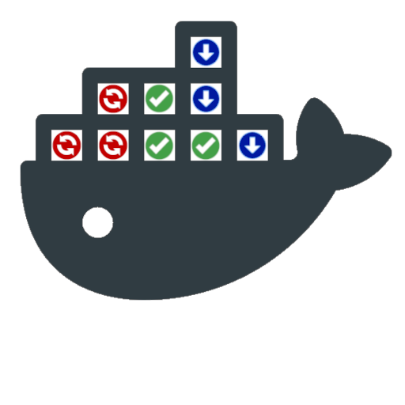
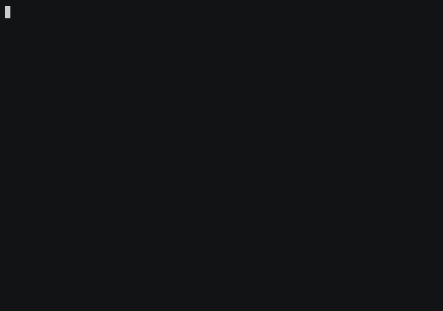

<p align="center">
  
</p>
<p align="center"> 
  
  
  <a href="https://www.gnu.org/licenses/gpl-3.0.html"></a>
  
  <a href="https://ko-fi.com/mag37"></a>
  <a href="https://liberapay.com/user-bin-rob/donate"></a>
  <a href="https://github.com/sponsors/mag37"></a>
</p>

<h3 align="center">A script checking updates for docker images <b>without pulling</b><br>Then selectively auto-update containers.</h3>
<h2 align="center">Now with a simple Apprise integration!</h2>
<h4 align="center">With features like excluding specific containers, filter by name, auto-prune dangling images and more.</h4>

___
## :bell: Changelog

- **v0.3.4**: Reworked selfupdate (auto git/curl/wget), general syntax cleanup, added -v for version.
- **v0.3.8**: Fixed `--env-file` logic to work with multiple env-files.
- **v0.3.7**: Added support for [labels](#bookmark-labels), added the `-f` option (force restart stack).
- **v0.3.6**: Added pushbullet template.
- **v0.3.5**: Added a simple progress bar for the registry checkup.
- **v0.3.4**: Added ntfy.sh template and error message on registry fail.
- **v0.3.3**: Added Apprise template and the option `-i` inform - to send notifications.
- **v0.3.2**: Added a notify function to wrap a notify-script, currently DSM/Ssmtp + template script.

___

## :nut_and_bolt: Dependencies
- Running docker (duh) and compose, either standalone or plugin.   
- [regclient/regctl](https://github.com/regclient/regclient) (Licensed under [Apache-2.0 License](http://www.apache.org/licenses/LICENSE-2.0))   
  - User will be prompted to download `regctl` if not in `PATH` or `PWD`.   
  - regctl requires `amd64/arm64` - see [workaround](#roller_coaster-workaround-for-non-amd64--arm64) if other architecture is used.
___




## :mag_right: `dockcheck.sh`
```
$ ./dockcheck.sh -h
Syntax:     dockcheck.sh [OPTION] [part of name to filter]
Example:    dockcheck.sh -y -d 10 -e nextcloud,heimdall

Options:"
-a|y   Automatic updates, without interaction.
-d N   Only update to new images that are N+ days old. Lists too recent with +prefix and age. 2xSlower.
-e X   Exclude containers, separated by comma.
-f     Force stack restart after update. Caution: restarts once for every updated container within stack.
-h     Print this Help.
-i     Inform - send a preconfigured notification.
-l     Only update if label is set. See readme.
-m     Monochrome mode, no printf color codes.
-n     No updates, only checking availability.
-p     Auto-Prune dangling images after update.
-r     Allow updating images for docker run, wont update the container.
-s     Include stopped containers in the check. (Logic: docker ps -a).
-v     Prints current version.
```


### Basic example:
```
$ ./dockcheck.sh
. . .
Containers on latest version:
glances
homer

Containers with updates available:
1) adguardhome
2) syncthing
3) whoogle-search

Choose what containers to update:
Enter number(s) separated by comma, [a] for all - [q] to quit:
```
Then it proceedes to run `pull` and `up -d` on every container with updates.   
After the updates are complete, you'll get prompted if you'd like to prune dangling images.

## :loudspeaker: Notifications
Trigger with the `-i` flag.   
Run it scheduled with `-ni` to only get notified when there's updates available!  

Use a `notify_X.sh` template file, copy it to `notify.sh`, modify it to your needs!   
Current templates:
- Synology [DSM](https://www.synology.com/en-global/dsm)
- Email with [sSMTP](https://wiki.debian.org/sSMTP)  
- Apprise (with it's [multitude](https://github.com/caronc/apprise#supported-notifications) of notifications)
  - both native [caronc/apprise](https://github.com/caronc/apprise) and the standalone [linuxserver/docker-apprise-api](https://github.com/linuxserver/docker-apprise-api)
  - Read the [QuickStart](extras/apprise_quickstart.md)
- [ntfy.sh](https://ntfy.sh/) - HTTP-based pub-sub notifications.
- [Pushbullet](https://www.pushbullet.com/) - connecting different devices with cross-platform features.

Further additions are welcome - suggestions or PR!   
<sub><sup>Initiated and first contributed by [yoyoma2](https://github.com/yoyoma2).</sup></sub>  

## :bookmark: Labels
Optionally add labels to compose-files. Currently these are the usable labels:
```
    labels:
      mag37.dockcheck.restart-stack: true
      mag37.dockcheck.update: true
```
- `mag37.dockcheck.restart-stack: true` works instead of the `-f` option, forcing stop+restart on the whole compose-stack (Caution: Will restart on every updated container within stack).
- `mag37.dockcheck.update: true` will when used with the `-l` option only update containers with this label and skip the rest. Will still list updates as usual.

## :roller_coaster: Workaround for non **amd64** / **arm64**
`regctl` provides binaries for amd64/arm64, to use on other architecture you could try this workaround.
Run regctl in a container wrapped in a shell script. Copied from [regclient/docs/install.md](https://github.com/regclient/regclient/blob/main/docs/install.md):

```sh
cat >regctl <<EOF
#!/bin/sh
opts=""
case "\$*" in
  "registry login"*) opts="-t";;
esac
docker container run \$opts -i --rm --net host \\
  -u "\$(id -u):\$(id -g)" -e HOME -v \$HOME:\$HOME \\
  -v /etc/docker/certs.d:/etc/docker/certs.d:ro \\
  ghcr.io/regclient/regctl:latest "\$@"
EOF
chmod 755 regctl
```
Test it with `./regctl --help` and then either add the file to the same path as *dockcheck.sh* or in your path (eg. `~/.local/bin/regctl`).

## :open_hands: Function to auth with docker hub before running
### Example
Change names, paths, and remove cat+password flag if you rather get prompted:
```sh
function dchk {
  cat ~/pwd.txt | docker login --username YourUser --password-stdin
  ~/dockcheck.sh "$@"
}
```

## :hammer: Known issues
- No detailed error feedback (just skip + list what's skipped).
- Not respecting `--profile` options when re-creating the container.
- Not working well with containers created by Portainer.

## :warning: `-r flag` disclaimer and warning
**Wont auto-update the containers, only their images. (compose is recommended)**   
`docker run` dont support using new images just by restarting a container.  
Containers need to be manually stopped, removed and created again to run on the new image.

## :scroll: License
dockcheck is created and released under the [GNU GPL v3.0](https://www.gnu.org/licenses/gpl-3.0-standalone.html) license.

### :floppy_disk: The [story](https://mag37.org/posts/project_dockcheck/) behind it. 1 year in retrospect.

___


## Special Thanks
- :bison: [t0rnis](https://github.com/t0rnis)   
- :leopard: [Palleri](https://github.com/Palleri)
