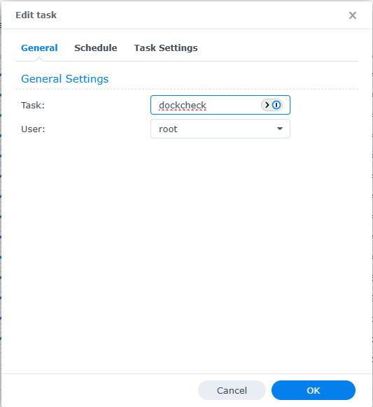
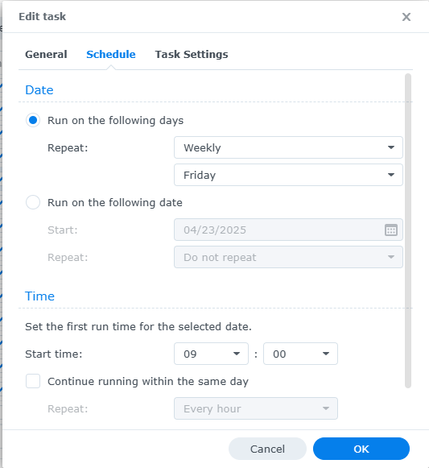
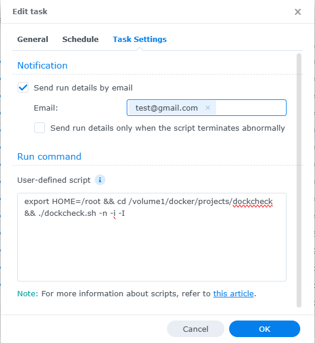

## Using Dockcheck in DSM
Dockcheck cannot directly update containers managed in the Container Manager GUI, but it can still be used to notify you of containers with updates available. There are two ways to be notified, each with their own caveats:

1. Enabling email notifications within the Task Scheduler (_step 6i below_) will send an email that includes the entire script as run. This will not include the `urls.list` links to release notes, but it will show a full list of containers checked, up to date, and needing updates (following the args included in the scheduled task).
2. The [DSM notification template](https://github.com/mag37/dockcheck/blob/main/notify_templates/notify_DSM.sh) will enable Dockcheck to directly send an email when using the `-i` or `-I` flag. This is most useful when paired with an accurate [urls.list](https://github.com/mag37/dockcheck/blob/next063/notify_templates/urls.list) file, and results in a neat succinct email notification of only containers to be updated.

This is a user preference, and both notifications are not necessary. However, regardless of the notification method, it is necessary to set up a scheduled task to run Dockcheck at a set interval (otherwise it will only run when manually triggered).

## Automate Dockcheck with DSM Task Scheduler:

1. Open Control Panel and navigate to Task Scheduler
2. Create a Scheduled Task > User-defined script
3. Task Name: Dockcheck
4. User: root
5. Schedule: _User Preference_
6. Task Settings:
    1. ✔  Send run details by email (include preferred email) _This is the optional step as described above)_
    2. User-defined script: `export HOME=/root && cd /path/to/dockcheck && ./dockcheck.sh -n -i -I ` _or other custom args_
8. Click OK, accept warning message

## Set up the DSM Notification template

Copy the [dockcheck/notify_templates/notify_DSM.sh](https://github.com/mag37/dockcheck/blob/main/notify_templates/notify_DSM.sh) to the same directory as where you keep `dockcheck.sh`.  
Use as is (uses your default notification email setting) or edit and override manually.

Made with much help and contribution from [@firmlyundecided](https://github.com/firmlyundecided) and [@yoyoma2](https://github.com/yoyoma2).
