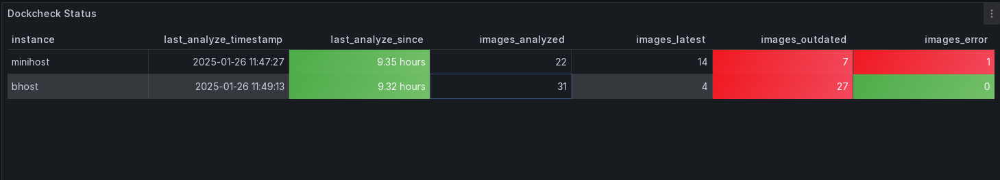

## [Prometheus](https://github.com/prometheus/prometheus) and [node_exporter](https://github.com/prometheus/node_exporter)
Dockcheck is capable to export metrics to prometheus via the text file collector provided by the node_exporter.
In order to do so the -c flag has to be specified followed by the file path that is configured in the text file collector of the node_exporter.
A simple cron job can be configured to export these metrics on a regular interval as shown in the sample below:

```
0 1 * * * /root/dockcheck.sh -n -c /var/lib/node_exporter/textfile_collector
```

The following metrics are exported to prometheus

```
# HELP dockcheck_images_analyzed Docker images that have been analyzed
# TYPE dockcheck_images_analyzed gauge
dockcheck_images_analyzed 22
# HELP dockcheck_images_outdated Docker images that are outdated
# TYPE dockcheck_images_outdated gauge
dockcheck_images_outdated 7
# HELP dockcheck_images_latest Docker images that are outdated
# TYPE dockcheck_images_latest gauge
dockcheck_images_latest 14
# HELP dockcheck_images_error Docker images with analysis errors
# TYPE dockcheck_images_error gauge
dockcheck_images_error 1
# HELP dockcheck_images_analyze_timestamp_seconds Last dockercheck run time
# TYPE dockcheck_images_analyze_timestamp_seconds gauge
dockcheck_images_analyze_timestamp_seconds 1737924029
```

Once those metrics are exported they can be used to define alarms as shown below

```
- alert: dockcheck_images_outdated
  expr: sum by(instance) (dockcheck_images_outdated) > 0
  for: 15s
  labels:
    severity: warning
  annotations:
    summary: "{{ $labels.instance }} has {{ $value }} outdated docker images."
    description: "{{ $labels.instance }} has {{ $value }} outdated docker images."
- alert: dockcheck_images_error
  expr: sum by(instance) (dockcheck_images_error) > 0
  for: 15s
  labels:
    severity: warning
  annotations:
    summary: "{{ $labels.instance }} has {{ $value }} docker images having an error."
    description: "{{ $labels.instance }} has {{ $value }} docker images having an error."
- alert: dockercheck_image_last_analyze
  expr: (time() - dockcheck_images_analyze_timestamp_seconds) > (3600 * 24 * 3)
  for: 15s
  labels:
    severity: warning
  annotations:
    summary: "{{ $labels.instance }} has not updated the dockcheck statistics for more than  3 days."
    description: "{{ $labels.instance }} has not updated the dockcheck statistics for more than 3 days."
```

There is a reference Grafana dashboard in [grafana/grafana_dashboard.json](./grafana/grafana_dashboard.json).


